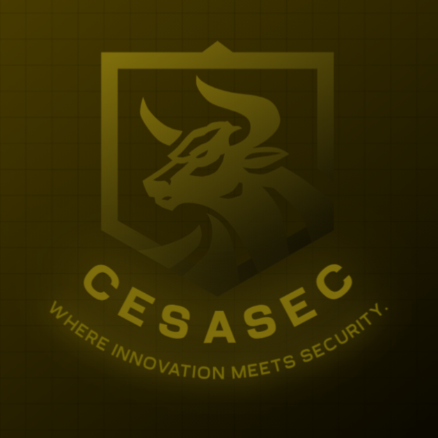

# CesaConn

<div align="center">
  
  
  ### Ready. Set. Connect.
  
  *CesaConn — connecting all your devices together securely.*

  
  
  
  
</div>

---

## What is CesaConn?

CesaConn is a **secure, serverless, cross-platform device synchronization application** built by CesaSec.

Sync your files, clipboard, notifications, and more — across all your devices — without any central server ever seeing your data. Your data stays yours. Always.

---

## Why CesaConn?

Most sync solutions force you to trust a third party with your data. CesaConn is different:

- **No central server** — data travels directly between your devices
- **End-to-end encrypted** — nobody can read your data, not even us
- **Two independent keys** — one for authentication, one for data
- **You are in full control** — every feature can be turned on or off
- **Zero data collection** — we don't know who you are, and we don't want to
- **Every feature is off by default after updates** — you decide what to enable

---

## Security Architecture

CesaConn is built with a military-grade security stack:

| Layer | Technology | Purpose |
|---|---|---|
| Key Exchange | X25519 ECDH | Ephemeral shared secret per session — never transmitted |
| Session Encryption | AES-256-GCM | Outer encryption layer using ephemeral session key |
| Data Encryption | AES-256-GCM | Inner encryption layer using pre-shared data key |
| Auth Verification | AES-256-GCM | Mutual authentication via encrypted pre-shared key |
| Key Derivation | Argon2 | Password → cryptographic key |
| Salt Generation | OS Entropy (SysRng) | Cryptographically secure randomness |
| Packet Signing | Ed25519 | Implemented — integration in progress |
| Memory Safety | Zeroize | Keys and secrets wiped from RAM after use |

---

### Two Independent Keys

CesaConn uses **two completely separate passwords and keys**:

```
Password 1 (auth)   → Argon2 → Auth Key    → used ONLY for authentication & discovery
Password 2 (data)   → Argon2 → Data Key    → used ONLY for data transfer
```

If one key is compromised — the other remains secure. Both must be broken simultaneously for an attacker to succeed.

---

### Full Connection Flow

```
════════════════════════════════════════════════════════
  UDP DISCOVERY — Encrypted Presence Broadcasting
════════════════════════════════════════════════════════

Device A (broadcaster)              Device B (listener)
   │                                        │
   │  name = "CesaConn Broadcast"           │
   │  packet = AES256(name, auth_key)       │
   │  broadcast → 255.255.255.255:3636 ───►│
   │                                        │
   │                    decrypt(packet, auth_key)
   │                    verify name matches
   │◄─────────── return sender IP ──────────│


════════════════════════════════════════════════════════
  STEP 1 — IP ALLOWLIST CHECK
════════════════════════════════════════════════════════

Device A                              Device B
   │                                     │
   │  Is peer IP in trusted_addrs?       │
   │  No  → reject immediately           │
   │  Yes → proceed                      │


════════════════════════════════════════════════════════
  STEP 2 & 3 — ECDH SESSION KEY EXCHANGE
════════════════════════════════════════════════════════

Device A                              Device B
   │                                     │
   │  private_a ← random (ephemeral)     │  private_b ← random (ephemeral)
   │  public_a = X25519(private_a)       │  public_b = X25519(private_b)
   │                                     │
   │──── public_a (32 bytes) ──────────►│
   │◄─── public_b (32 bytes) ────────────│
   │                                     │
   │  shared = ECDH(private_a, public_b) │  shared = ECDH(private_b, public_a)
   │  session_key = SHA256(shared)        │  session_key = SHA256(shared)
   │                                     │
   │  zeroize(private_a, shared)         │  zeroize(private_b, shared)
   │  session_key NEVER transmitted      │


════════════════════════════════════════════════════════
  STEP 4 — MUTUAL AUTHENTICATION
════════════════════════════════════════════════════════

Device A                              Device B
   │                                     │
   │  encrypted = AES256(auth_key,       │
   │              session_key)           │
   │──── encrypted (60 bytes) ─────────►│
   │                    decrypt(encrypted, session_key)
   │                    verify == auth_key
   │                    mismatch → reject
   │◄─── encrypted (60 bytes) ───────────│
   │  verify server knows same auth_key  │


════════════════════════════════════════════════════════
  STEP 5 — CONFIRMATION
════════════════════════════════════════════════════════

Device A                              Device B
   │                                     │
   │  0x01 = verified, 0x00 = rejected   │
   │──── confirmation byte ────────────►│
   │                                     │
   │  Both parties now share session_key │
   │  and are mutually authenticated     │


════════════════════════════════════════════════════════
  DATA TRANSFER — Double-Layer Encryption
════════════════════════════════════════════════════════

Device A                              Device B
   │                                     │
   │  inner = AES256(data, data_key)     │
   │  outer = AES256(inner, session_key) │
   │                                     │
   │  init_header = AES256([action_type  │
   │    | data_size], session_key)       │
   │                                     │
   │──── init_header (37 bytes) ───────►│
   │──── outer (N bytes) ───────────────►│
   │                    decrypt(outer, session_key) → inner
   │                    decrypt(inner, data_key) → data ✅
```

---

### Packet Layout

```
Init Header (37 bytes, encrypted with session key):
  [ 12-byte nonce | 1-byte action_type | 8-byte data_size_le | 16-byte GCM tag ]

Data Packet (N bytes):
  [ outer: AES256-GCM with session_key [ inner: AES256-GCM with data_key [ plaintext ] ] ]

Auth Exchange (60 bytes per direction):
  [ 12-byte nonce | 32-byte encrypted key | 16-byte GCM tag ]
```

---

### Action Types

| Value | Name | Description |
|---|---|---|
| `0x00` | `Default` | Fallback for unknown types — forward compatible |
| `0x01` | `Debug` | Testing and diagnostics |
| `0x02` | `ConnectNewDevice` | Add a new device to trusted_addrs — no data payload |
| `0x03` | `ClipboardSync` | Clipboard synchronization *(planned)* |

---

### Why this matters

| Attack | CesaConn |
|---|---|
| Man-in-the-middle | ❌ Blocked by mutual authentication |
| Packet tampering | ❌ Blocked by AES-256-GCM integrity tags |
| Replay attack | ❌ Blocked by unique nonces per packet |
| Eavesdropping | ❌ Blocked by double-layer AES-256-GCM |
| Auth key compromise | ❌ Data key still secure |
| Data key compromise | ❌ Past sessions protected by ephemeral session keys |
| Brute force password | ❌ Blocked by Argon2 KDF |
| Key theft from RAM | ❌ Keys wiped by Zeroize |
| Unknown device connects | ❌ Blocked by IP allowlist before any crypto |
| Server breach | ❌ There is no server |

---

## Features

### Core (Implemented)
- [x] Mutual authentication with dual-key system
- [x] ECDH ephemeral session key exchange (forward secrecy)
- [x] Double-layer end-to-end encryption (session key + data key)
- [x] Encrypted UDP device discovery
- [x] IP allowlist trusted device enforcement
- [x] Full offline / serverless operation
- [x] Structured tracing (`RUST_LOG` configurable)

### In Progress
- [ ] Ed25519 packet signing integration
- [ ] TCP streaming for large file transfers

### Planned for v1.0
- [ ] File synchronization
- [ ] Clipboard sync
- [ ] Notification mirroring
- [ ] Zero Trust device authorization

### Transport Support
- [ ] WiFi / LAN (TCP + UDP)
- [ ] WiFi Hotspot
- [ ] Bluetooth LE

### Platform Support
- [ ] Windows
- [ ] Linux
- [ ] Android
- [ ] macOS *(planned)*
- [ ] iOS *(under consideration)*

---

## Philosophy

> Every feature is **off by default** after updates. You decide what to enable. We don't decide for you.

CesaConn is built on the belief that software should serve the user — not the developer. No forced features. No hidden telemetry. No dark patterns.

---

## Repository Structure

```
CesaConn/
├── cesa_conn_crypto/        # Cryptography module
│   ├── src/
│   │   ├── aes.rs           # AES-256-GCM encryption/decryption
│   │   ├── ecc.rs           # Ed25519 digital signatures
│   │   ├── ecdh.rs          # X25519 ECDH key exchange + SHA-256 hashing
│   │   ├── salt.rs          # Cryptographically secure salt generation
│   │   ├── pswd_manager.rs  # Argon2 password-based key derivation
│   │   └── lib.rs
│   └── Cargo.toml
│
└── cesa_conn_networker/     # Networking module
    ├── src/
    │   ├── auth.rs           # 5-step mutual authentication handshake
    │   ├── udp_networker.rs  # Encrypted device discovery (UDP broadcast)
    │   ├── tcp_networker.rs  # Double-encrypted data transfer (TCP)
    │   ├── cesa_conn_networker.rs  # Entry point / test runner
    │   └── lib.rs
    └── Cargo.toml
```

---

## Building from Source

### Requirements
- Rust 1.75+
- Cargo

### Build

```bash
git clone https://github.com/cesasec/cesaconn
cd CesaConn
cargo build --release
```

### Run Tests

```bash
# Test cryptography module
cargo test -p cesa_conn_crypto

# Test networking module
cargo test -p cesa_conn_networker
```

### Manual Integration Test

```bash
# Terminal 1 — server device
cargo run -- servertest

# Terminal 2 — client device
cargo run -- clienttest
```

Tracing verbosity is configurable via `RUST_LOG`:

```bash
RUST_LOG=cesa_conn=trace cargo run -- servertest
```

---

## Privacy

CesaConn is designed with privacy as a core principle, not an afterthought:

- **No account required** to use the application
- **No telemetry** — we don't collect usage data
- **No analytics** — we don't track you
- **No servers** — there is nothing to breach
- **Open source** — verify our claims yourself

---

## License

CesaConn is licensed under [AGPL 3.0](LICENSE).

This means any modified version of CesaConn must also be released under AGPL 3.0, including when run over a network.

CesaConn application — Proprietary (CesaSec)

---

## About CesaSec

**CesaSec** — *Where Innovation Meets Security.*

CesaConn is a product of CesaSec, an independent security-focused software company.

---

<div align="center">
  <i>Built with ❤️ and Rust 🦀</i>
</div>
